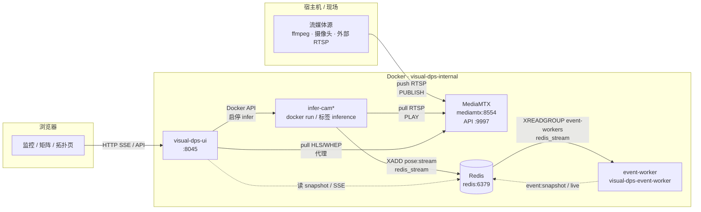
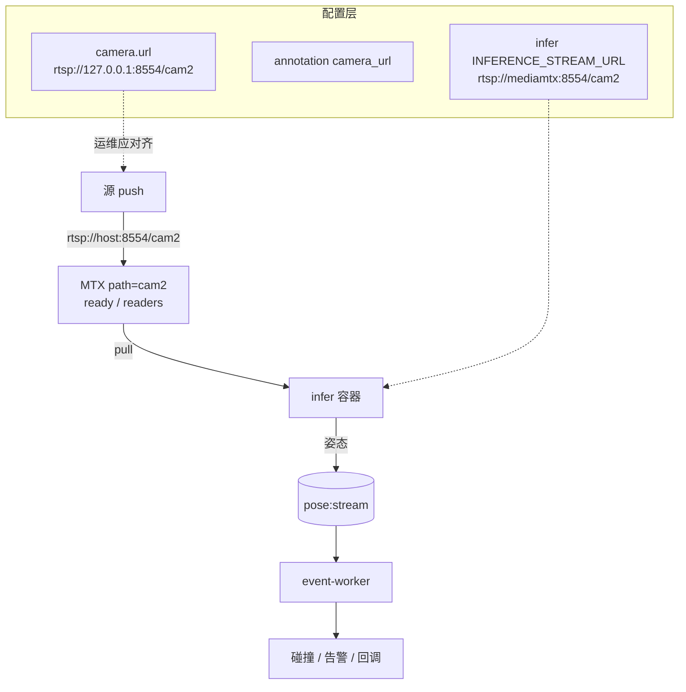
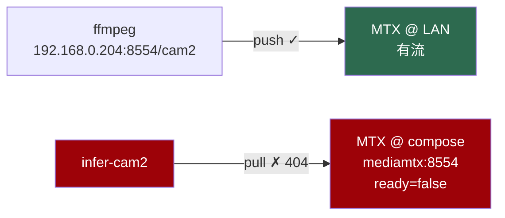

# 服务拓扑（页面与架构图）

- **路由**：`/topology`（导航与「事件矩阵」平级）
- **API 契约**：[`TOPOLOGY_API.md`](./TOPOLOGY_API.md)
- **JSON Schema**：[`schemas/topology-overview.schema.json`](./schemas/topology-overview.schema.json)
- **示例响应**：[`schemas/topology-overview.example.json`](./schemas/topology-overview.example.json)

---

## 全局拓扑（compose 默认）

---

## 单路摄像头数据流（publisher 模式）

**健康判定要点**

| 检查项 | 正常 | 异常示例 |
|--------|------|----------|
| MTX `ready` | `true` | `false` → 无推流 |
| infer `stream_url` probe | 可达 | 404 → 空转无骨架 |
| 配置 URL 与 infer URL | 同一 MTX 实例 | 推到 `192.168.x.x`，拉 `mediamtx` |
| infer → Redis | XADD 有增量 | worker 无 pose 输入 |
| pose 新鲜度 | `last_ts_age_sec` ≤ 阈值且未 `frozen` | `INFER_POSE_FROZEN`：有流但关键点不随帧变 |
| pose 停更 | MTX 有流但 snapshot 过期 | `POSE_STALE`：infer 未再 publish |

---

## 故障态示例（本次踩坑）

拓扑页应对 `INFER_STREAM_MISMATCH` 高亮：**绿** = 有流实例，**红** = infer 实际拉流。

---

## 页面线框

主区域为全宽拓扑图；**链路详情**在右侧抽屉打开（与摄像头设置抽屉同款）。触发：**仅**点击拓扑图中的源/推理节点（连线不可点）。

- 节点色：`health` → ok 绿 / warn 黄 / error 红 / unknown 灰
- 拓扑图：**始终显示全部**节点与连线；点选某路时仅加粗该路连线（其它线变淡），节点不变灰；关抽屉或再点同一节点取消选择
- 抽屉「链路连接」：仅当前选中摄像头相关边；点具体节点时收窄为与该节点相连的边
- 抽屉其余块：`paths[]` 问题码 / 配置 / 运行时

---

## 与现有文档关系

| 文档 | 关系 |
|------|------|
| [`PIPELINE_SPLIT.md`](./PIPELINE_SPLIT.md) | Redis pose/event 契约 |
| [`USER_MANUAL.md`](./USER_MANUAL.md) § FFmpeg 推流 | 源侧 push 操作 |
| [`TOPOLOGY_API.md`](./TOPOLOGY_API.md) | 本页后端接口 |
