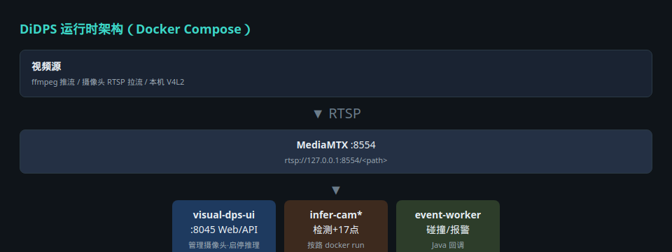
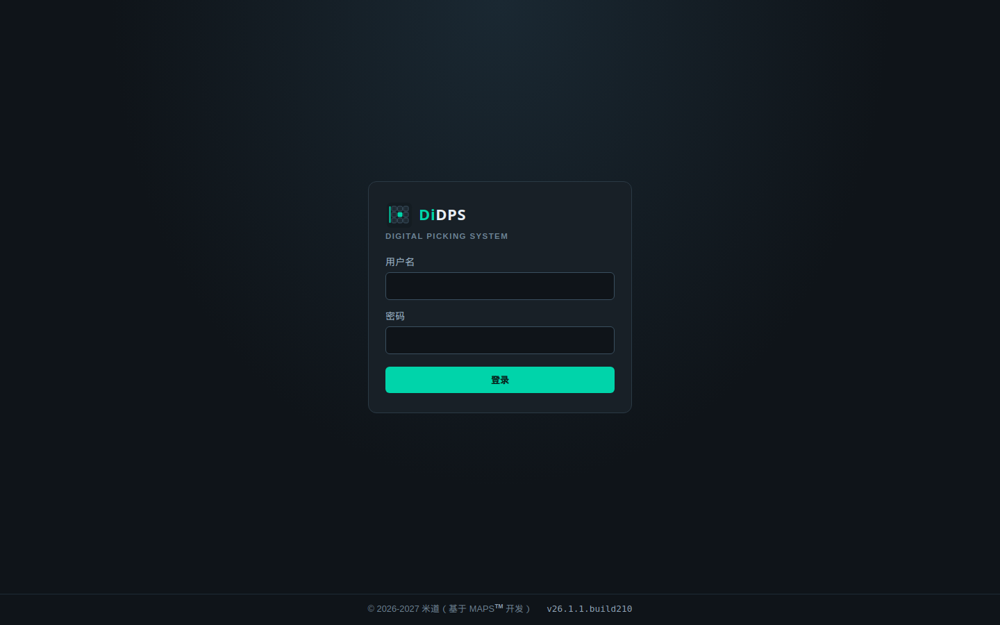
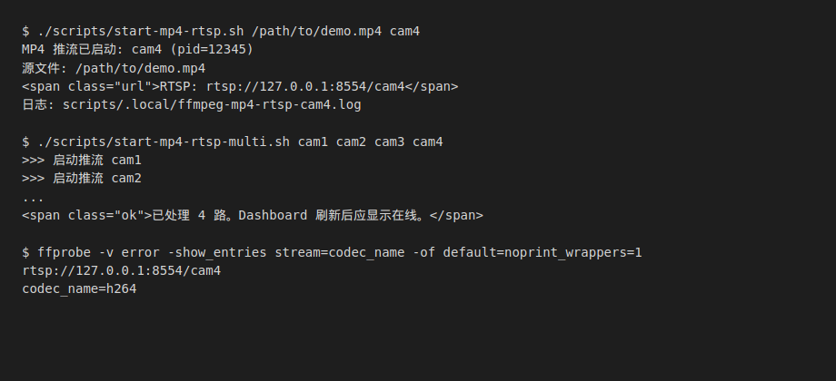
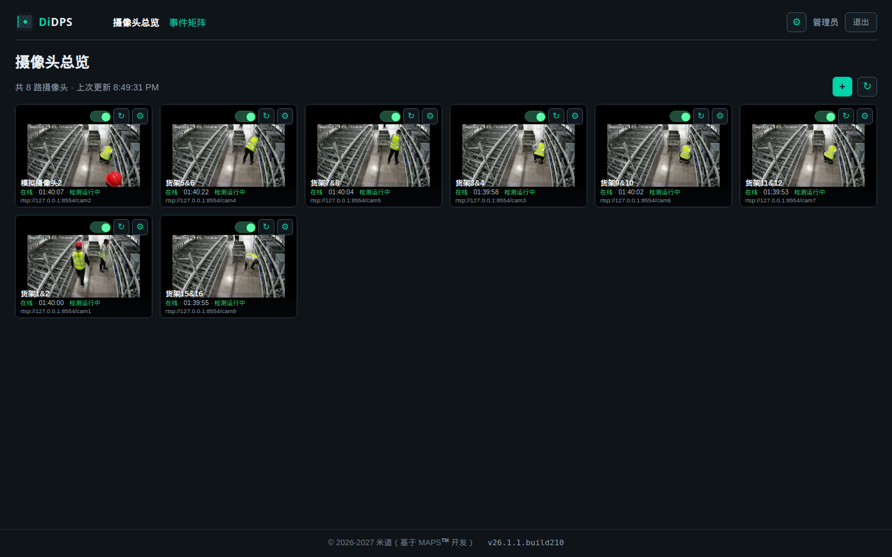
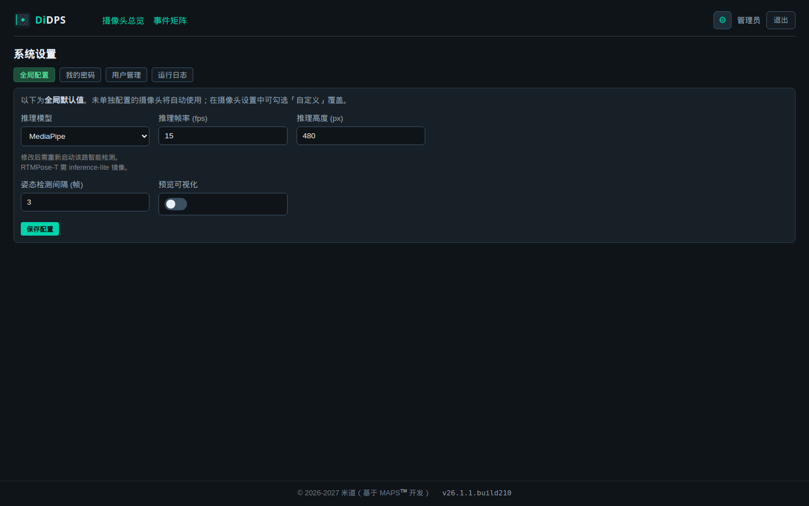
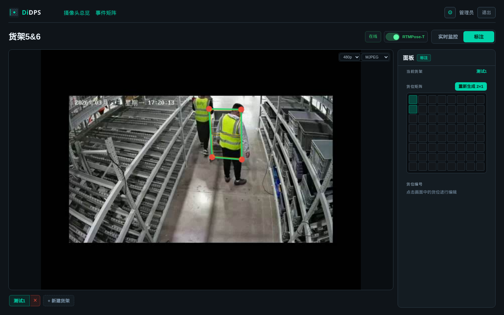
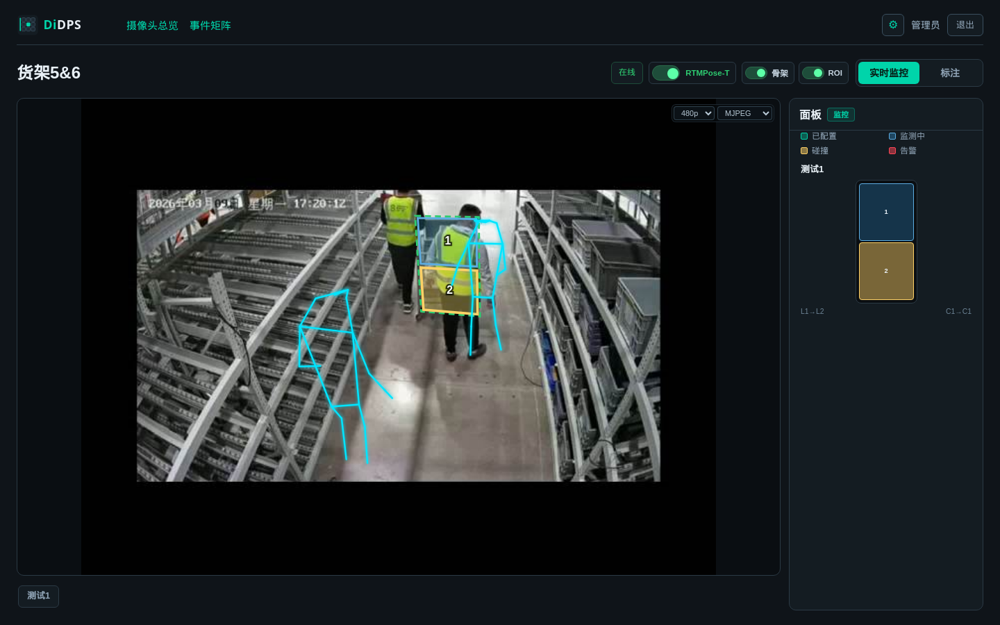
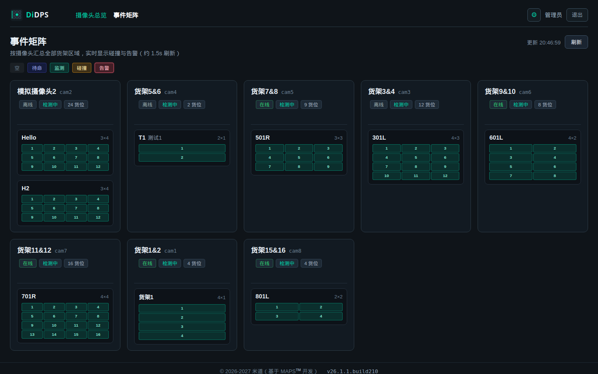

# DiDPS 使用手册

**DiDPS**（Digital Picking System，深度智能数字拣选系统）用于仓库现场：对摄像头画面做**人体检测 + 17 点姿态估计**，结合货架货位标注做**碰撞/告警**，并可回调上游业务系统。

本手册面向**现场工程师与运维**，覆盖从安装、推流、标注到开启智能检测的完整流程。

---

## 目录

1. [系统能做什么](#1-系统能做什么)
2. [架构一览](#2-架构一览)
3. [环境准备与首次启动](#3-环境准备与首次启动)
4. [登录与页面导航](#4-登录与页面导航)
5. [视频源与 FFmpeg 推流（Publisher）](#5-视频源与-ffmpeg-推流publisher)
6. [摄像头管理](#6-摄像头管理)
7. [货位标注](#7-货位标注)
8. [开启智能检测](#8-开启智能检测)
9. [监控页：预览 / 骨架 / 碰撞](#9-监控页预览--骨架--碰撞)
10. [事件矩阵](#10-事件矩阵)
11. [系统设置](#11-系统设置)
12. [配置与数据文件](#12-配置与数据文件)
13. [常见问题](#13-常见问题)
14. [附录：命令速查](#14-附录命令速查)

---

## 1. 系统能做什么

| 能力 | 说明 |
|------|------|
| 多路摄像头 | 每路独立 RTSP 通道，总览页统一管理 |
| 人体检测（det） | 在画面中找到人体边框 |
| 姿态估计（pose） | 每人 17 个 COCO 关键点（肩、肘、腕等） |
| 碰撞检测 | **不在推理容器内**；由 event-worker 读姿态 + 标注 ROI 计算 |
| 实时展示 | 监控页 SSE 叠加骨架与碰撞状态 |
| 事件矩阵 | 按货架/货位汇总在线、监测、碰撞、告警 |
| 回调 | event-worker 可按配置 POST 到 Java 等业务端 |

**推理后端可选：**

- `mmpose` — 完整 GPU 镜像（精度高，资源占用大）
- `mediapipe` — 轻量 CPU，适合联调
- `rtmpose_onnx` — RTMDet-nano + RTMPose-t，**CPU 多路推荐**（需 inference-lite 镜像）

---

## 2. 架构一览



**数据流简述：**

1. **ffmpeg / 摄像头** 向 MediaMTX 推送 RTSP（如 `rtsp://127.0.0.1:8554/cam4`）
2. **推理容器**（每路一个，由 UI 拉起）读 RTSP → 检测 + 姿态 → 写入 Redis
3. **event-worker** 消费姿态 → 碰撞/告警 → Redis + 可选 Java 回调
4. **浏览器** 通过 UI 的 SSE 看到合并后的骨架与事件

> 推理容器 **不会** 随 `docker compose up` 自动启动，需要在总览页手动「开启智能检测」。

---

## 3. 环境准备与首次启动

### 3.1 依赖

- Docker + Docker Compose
- macOS / Linux / WSL2（Windows 建议 WSL2 + Docker Desktop）
- 演示推流需本机安装 **ffmpeg**（`sudo apt install ffmpeg`）

### 3.2 配置

```bash
cd visual-dps
cp .env.example .env
# 编辑 .env：至少修改 REDIS_PASSWORD
# 浏览器本机访问 WebRTC 时：MEDIAMTX_PUBLIC_HOST=127.0.0.1
```

确认以下文件存在（可按现场修改）：

| 文件 | 作用 |
|------|------|
| `app_config.json` | 全局默认（推理帧率、模型路径等） |
| `localdata/camera_ips.json` | 摄像头列表 |
| `localdata/json/<cam>.json` | 每路货位标注 |

### 3.3 构建与启动

```bash
# 首次或代码变更后
docker compose build

# 启动基础栈：Redis + MediaMTX + UI + event-worker
docker compose up -d

# 若使用 RTMPose-T / MediaPipe，需构建轻量推理镜像
docker compose build visual-dps-inference-lite
# 或：./scripts/build-inference-lite-image.sh
```

### 3.4 访问地址

| 服务 | 地址 |
|------|------|
| **Web UI** | http://127.0.0.1:8045 |
| **RTSP（推流目标）** | `rtsp://127.0.0.1:8554/<path>` |
| MediaMTX HLS | http://127.0.0.1:8888（一般由 UI 代理，不直接访问） |

---

## 4. 登录与页面导航

### 4.1 登录



- 默认本地账号：**admin** / **admin123**（首次初始化用户文件时写入，见 `services/auth_service.py`）
- 登录后请在 **设置 → 修改密码** 修改默认密码

### 4.2 主要页面

| 路径 | 菜单 | 用途 |
|------|------|------|
| `/` | 摄像头总览 | 看在线状态、抓帧、配置、启停检测 |
| `/monitor?camera=cam4` | （从卡片进入） | 实时预览、标注、看骨架/碰撞 |
| `/matrix` | 事件矩阵 | 货架货位状态总览 |
| `/topology` | 服务拓扑 | 推流 / MediaMTX / 推理 / Redis / event-worker 链路与地址诊断 |
| `/settings` | 设置 | 全局推理参数、用户、日志 |
| `/annotate` | （兼容旧入口） | 独立标注页；推荐在监控页「标注」模式完成 |

---

## 5. 视频源与 FFmpeg 推流（Publisher）

现场最常见模式：**MediaMTX 在 Docker 内监听，宿主机 ffmpeg 把 MP4 或摄像头流转推到指定 path**。

### 5.1 概念

- 每个摄像头有一个 **path**（如 `cam4`），与 `camera_ips.json` 里 `id` / `path` 一致
- 推流 URL 形如：`rtsp://127.0.0.1:8554/cam4`
- 摄像头配置里 **流地址** 填同一 URL；MediaMTX 收到推流后，总览页显示 **在线**

### 5.2 一键多路演示推流（推荐）

确保 `docker compose up -d mediamtx` 已运行，然后：

```bash
# 8 路同时推同一段 MP4（每路独立 ffmpeg 进程）
./scripts/start-mp4-rtsp-multi.sh cam1 cam2 cam3 cam4 cam5 cam6 cam7 cam8

# 指定视频文件 + 多路
./scripts/start-mp4-rtsp-multi.sh /path/to/demo.mp4 cam2 cam3 cam4
```

### 5.3 单路推流

```bash
./scripts/start-mp4-rtsp.sh /path/to/demo.mp4 cam4
```

脚本会：

- 检查 `visual-dps-mediamtx` 容器是否运行
- 用 ffmpeg 循环推流（640×480、15fps、H.264）
- 在 `scripts/.local/` 写入 pid 与日志



### 5.4 手动 ffmpeg（与脚本等价）

```bash
ffmpeg -re -stream_loop -1 -i demo.mp4 \
  -vf "scale=640:480:force_original_aspect_ratio=decrease,pad=640:480:(ow-iw)/2:(oh-ih)/2" \
  -r 15 -c:v libx264 -pix_fmt yuv420p -preset ultrafast -tune zerolatency \
  -b:v 800k -maxrate 800k -bufsize 1600k -g 15 \
  -f rtsp -rtsp_transport tcp rtsp://127.0.0.1:8554/cam4
```

`-c copy` 仅当 MP4 编码与 MediaMTX 完全兼容时可尝试；演示脚本默认 **转码** 以提高兼容性。

### 5.5 验证推流是否成功

```bash
# 应返回 codec_name=h264 等，无 error
ffprobe -v error -show_entries stream=codec_name \
  -of default=noprint_wrappers=1 rtsp://127.0.0.1:8554/cam4
```

总览页对应卡片应变为 **在线**，并显示最近活动时长。

### 5.6 停止推流

```bash
./scripts/stop-mp4-rtsp.sh cam4          # 停单路
./scripts/stop-mp4-rtsp.sh               # 停 cam1～cam8
./scripts/stop-mp4-rtsp.sh cam2 cam3     # 停多路
```

> **注意：** 重启 MediaMTX 容器后，RTSP publisher 会断开，需要 **重新执行推流脚本**。

### 5.7 其他视频源类型

在 `camera_ips.json` 中 `source_type` 可为：

| 类型 | 含义 |
|------|------|
| `external` | 使用 `url` 字段完整 RTSP 地址（最常见，含本机 MediaMTX path） |
| `publisher` | 仅声明 path，等待向 MediaMTX 推流 |
| `rtsp_pull` | MediaMTX 主动从 `pull_url` 拉流 |
| `v4l2` | 本机 USB 摄像头（Linux 设备路径） |

---

## 6. 摄像头管理



### 6.1 总览卡片说明

- **在线 / 离线** — 能否从 RTSP 读到流
- **检测运行中 / 未启动** — 推理 Docker 容器是否在跑
- **↻** — 抓帧刷新缩略图
- **⚙ 设置** — 打开配置抽屉
- **开关** — 开启 / 关闭智能检测（拉起或停止推理容器）

### 6.2 添加摄像头

1. 点击右上角 **+**
2. 填写 **通道编号**（如 `cam4`，即 MediaMTX path）
3. 填写 **名称**、**流地址**（如 `rtsp://127.0.0.1:8554/cam4`）
4. 保存后若提示 MediaMTX 重载，刷新总览即可

### 6.3 单路个性化配置



点击 **⚙ 设置** 可覆盖全局默认值，常用项：

| 配置项 | 说明 |
|--------|------|
| 推理模型 | `mmpose` / `mediapipe` / `rtmpose_onnx` |
| 推理帧率 | 主循环目标 fps（默认 15） |
| 推理高度 | 缩小后再推理，降低 CPU（如 240） |
| 姿态检测间隔 | 每 N 帧跑一次 pose + 发 Redis（默认 3） |

修改 **推理模型** 或关键参数后，需 **关闭再开启** 该路智能检测。

---

## 7. 货位标注

标注定义货架上的货位框（ROI），供 event-worker 做碰撞判断。

### 推荐路径

监控页 → 切换到 **标注** 模式。



### 7.1 流程

1. 总览页点击摄像头卡片进入监控（或访问 `/monitor?camera=cam4&mode=annotate`）
2. 切换到 **标注**
3. 在左侧工具栏选择货架、绘制/调整货位框
4. **保存** — 写入 `localdata/json/<camera>.json`
5. 切回 **实时监控** 查看效果

### 7.2 注意

- 标注基于 **抓帧分辨率**；流分辨率变化过大时需重新标注或校验
- 推理容器启动时会加载同 camera 的 JSON；缺失标注则无法做货位碰撞

---

## 8. 开启智能检测

1. 确认摄像头 **在线**（推流正常）
2. 确认 **标注 JSON** 已保存
3. 在总览卡片上打开 **智能检测** 开关

系统将：

- 通过 Docker API 启动 `visual-dps-infer-<camera>` 容器
- 容器内读 `rtsp://mediamtx:8554/<path>`（自动改写，无需手改）
- 日志示例：`ℹ️ 推理后端: rtmpose_onnx`

**性能提示（CPU / RTMPose-T）：**

- 主循环 fps 受 det+pose 耗时限制，常显著低于 `frame_rate`
- Redis 姿态发布频率 ≈ `主循环 fps ÷ pose_frame_interval`
- 多路同时开启会争抢 CPU，按现场能力控制并发路数

---

## 9. 监控页：预览 / 骨架 / 碰撞



### 9.1 播放方式

右上角可选 **MJPEG / HLS / WebRTC**（取决于浏览器与网络）：

- **MJPEG** — 最简单，延迟略高
- **HLS** — 需 MediaMTX 有流；走 UI 同源代理
- **WebRTC** — 低延迟；需 `.env` 中 `MEDIAMTX_PUBLIC_HOST` 与 ICE 端口 8189 可达

### 9.2 叠加层

| 开关 | 含义 |
|------|------|
| 骨架 | 17 点关键点与连线 |
| ROI | 标注货位框 |
| 面板 | 右侧货位状态与图例 |

货位颜色：**绿** 已配置 → **蓝** 监测中 → **黄** 碰撞 → **红** 告警

### 9.3 推理模型标签

监控页标题旁显示当前生效后端（如 **RTMPose-T**），来自摄像头个性化或全局默认。

---

## 10. 事件矩阵



- 按 **摄像头 × 货架** 展示所有货位格
- 颜色与监控页 legend 一致
- 点击货位可跳转到对应监控页（若已配置 box）

适合中控大屏快速扫视全场状态。

---

## 11. 系统设置


管理员可见：

- **系统** — 全局推理默认、调试项等（写入 `localdata/runtime_config.json`）
- **用户** — 增删用户、角色
- **日志** — 近期操作与系统日志

普通操作员可 **修改自己的密码**。

---

## 12. 配置与数据文件

| 路径 | 说明 |
|------|------|
| `app_config.json` | 出厂默认；可被 runtime 覆盖 |
| `localdata/runtime_config.json` | UI 保存的全局覆盖 |
| `localdata/camera_ips.json` | 摄像头列表 + 每路 `settings` |
| `localdata/json/<cam>.json` | 标注 |
| `localdata/mediamtx.yml` | 由服务根据摄像头列表生成 |
| `localdata/inference/<cam>.status.json` | 推理容器状态 |
| `localdata/auth_users.json` | 本地用户 |
| `.env` | Compose 环境变量（端口、Redis 密码等） |

**没有**单独的「摄像头配置数据库」；SQLite 仅用于日志库。

---

## 13. 常见问题

### 总览显示离线

1. MediaMTX 是否运行：`docker ps | grep mediamtx`
2. 是否已推流：`ffprobe rtsp://127.0.0.1:8554/<path>`
3. 重启 MediaMTX 后是否 **重新推流**
4. `camera_ips.json` 中 `url` 是否与推流 path 一致

### 开启检测后立刻报错 / 退出

1. 是否已构建推理镜像：`docker compose build visual-dps-inference-lite`
2. 查看状态文件：`localdata/inference/<cam>.status.json`
3. 查看容器日志：`docker logs visual-dps-infer-<cam>`

### 选了 RTMPose-T 保存后又变回别的

- 已修复：需使用含 `rtmpose_onnx` 白名单的版本；保存后看 `camera_ips.json` 是否含 `"models.backend": "rtmpose_onnx"`

### 监控页 HLS 404 / WebRTC 黑屏

- 见 [DEPLOY.md](./DEPLOY.md) 播放排障章节
- WebRTC：检查防火墙 UDP/TCP **8189**、`MEDIAMTX_PUBLIC_HOST`

### 姿态 / 碰撞更新很慢

- 属预期：推理慢 + `pose_frame_interval` 跳帧；碰撞依赖 Redis 姿态帧
- 减少并发路数、降低分辨率、或换更快后端

### 更新配图（维护者）

```bash
# UI 已启动时
node scripts/capture-manual-screenshots.mjs
# 输出：docs/images/user-manual/*.png
```

---

## 14. 附录：命令速查

```bash
# 启动栈
docker compose up -d

# 重建 UI 后
docker compose build visual-dps-ui && docker compose up -d visual-dps-ui

# 演示推流
./scripts/start-mp4-rtsp-multi.sh cam1 cam2 cam3 cam4 cam5 cam6 cam7 cam8

# 停止推流
./scripts/stop-mp4-rtsp.sh

# 查看推理容器
docker ps --filter name=visual-dps-infer

# 查看 cam4 推理日志
docker logs -f visual-dps-infer-cam4

# 查看 Redis 最新姿态 snapshot
docker exec visual-dps-redis redis-cli -a "$REDIS_PASSWORD" GET pose:snapshot:cam4
```

---

**相关文档**

- [DEPLOY.md](./DEPLOY.md) — Docker 交付与 WebRTC 排障
- [PIPELINE_SPLIT.md](./PIPELINE_SPLIT.md) — Redis 契约与 event-worker
- [CHANGELOG.md](./CHANGELOG.md) — 版本变更记录
- [HANDOFF.md](../HANDOFF.md) — 开发者交接
